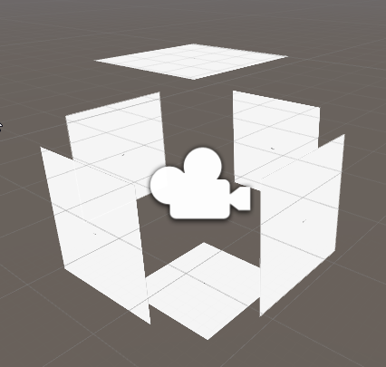
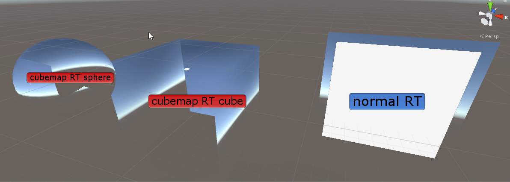

Unity Bug Demo: render to cubemap ignores world space UI
========================================================

This is a minimal demo project showing an issue with `Camera.RenderToCubemap()` - it does not render world-space UI, even thought it should.  
This is a known bug, but there is very little interest  seen on Unity's part to fix this - this project hopes to change it.

The demo consists of one scene (`main.unity`) that has a camera that renders to a 2D render texture and a cubemap render texture.

The camera is surrounded by UI panels that obscure most of it's view.
  

The render textures are then projected on scene geometry.  

As you can see, the panels are rendered in the normal render texture, but not in the cubemap render texture.

Links related to this bug
-------------------------

* Unity Feedback: [SUPPORT FOR WORLD SPACE UI ELEMENTS IN RENDERTOCUBEMAP](https://feedback.unity3d.com/suggestions/support-for-world-space-ui-elements-in-rendertocubemap)  
  Feedback for this bug. This demo is exactly for this issue.
* StackOverflow: [How to make UI visible in RenderToCubemap output (or how to make cubemaps another way)](https://stackoverflow.com/questions/49796485/how-to-make-ui-visible-in-rendertocubemap-output-or-how-to-make-cubemaps-anothe)  
  Question asked by me for this issue.
